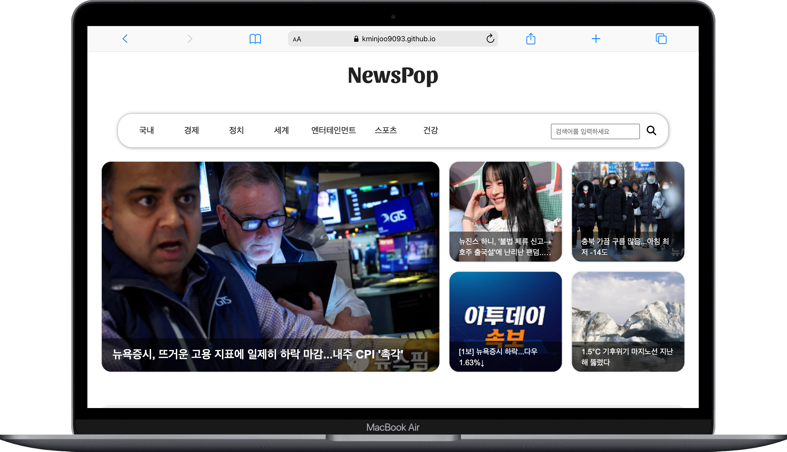
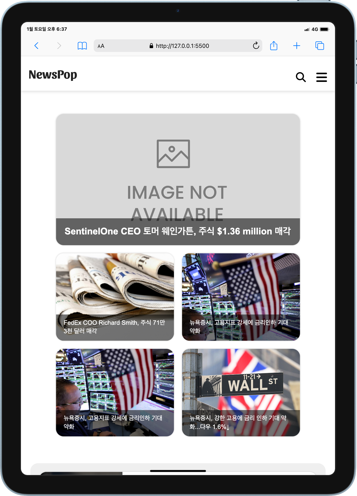
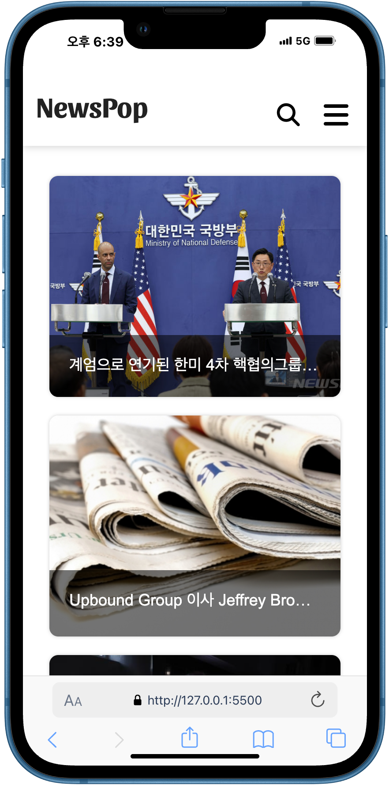
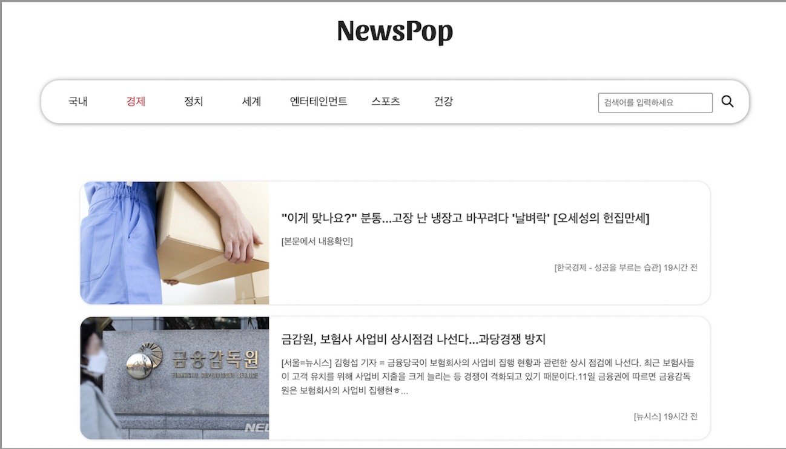
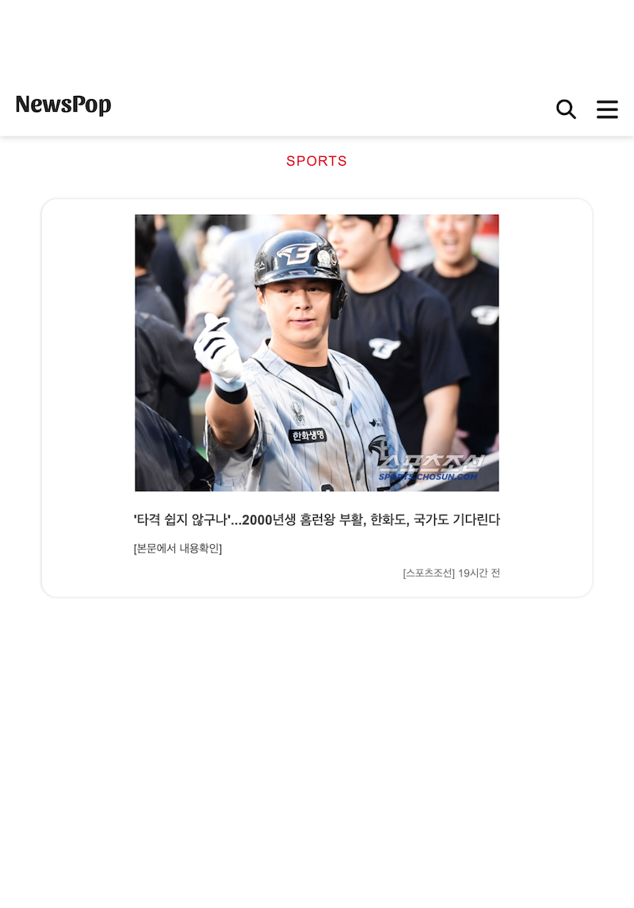
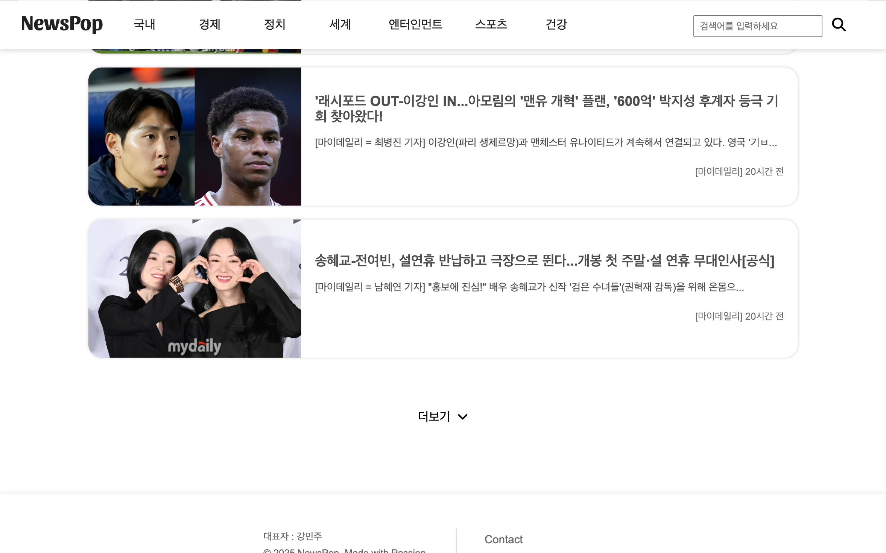

# NewsPop 뉴스 웹사이트 제작

<br>
오픈 api이용한 반응형 뉴스 웹사이트 제작 <br>
제작시기 : 2025.01 <br><br>

link : https://kminjoo9093.github.io/NewsPop-project/
<br><br><br>

 


<br><br><br>

## ☝️ &nbsp; 목표

<br>

1️⃣ &nbsp; 오픈 api를 이용해 조건에 맞는 다양한 데이터를 요청하고 처리하는 방법 학습<br><br>
2️⃣ &nbsp; 그 과정에서 발생하는 에러 상황을 처리하고 사용자에게 적절한 메시지 제공
  <br><br><br><br>

## 🛠 &nbsp; 사용 스킬

- HTML
- CSS
- Javascript
- jQuery
  
  <br><br><br><br>

## 💻 &nbsp; 주요 기능

<br>

### 1. 현재 카테고리 표시 <br><br>

  (PC 버전)<br>
  <br>
  
  (태블릿, 모바일 버전)<br>
  <br><br>
  
**[관련 코드]**
<br>

1️⃣ &nbsp; 선택한 카테고리 정보를 sessionStorage에 저장한다. 페이지 이동 후 저장된 카테고리 정보와 일치하는 카테고리의 스타일을 변경한다.<br>
  ```javascript
  //카테고리 별 뉴스 받아오기
  async function getNewsByCategory(e) {
  e.preventDefault();
  sessionStorage.clear();
  const selectedMenu = e.target.getAttribute("data-menu_en").toLowerCase();
  const url = new URL(baseUrl);
  url.searchParams.set("category", selectedMenu);
  newsList = await getNews(url);

  sessionStorage.setItem("category", selectedMenu);
  sessionStorage.setItem("newsList", JSON.stringify(newsList));
  window.location.href = e.target.href;
  }
  
  //문서 로드 후 스크린 크기 별 카테고리 처리
  document.addEventListener("DOMContentLoaded", () => updateNewsWithCategory());


  //리사이즈 이벤트
  let resizeTimer;
  
  window.addEventListener("resize", () => {
    clearTimeout(resizeTimer);
  
    showCategory(storedCategory);
    resizeTimer = setTimeout(() => {
      if (window.innerWidth > 1080) {
        clickCategory(".pc_menu a");
      } else {
        clickCategory(".m_menu a");
      }
    updateNewsWithCategory();
    }, 300); 
  });

  //카테고리별 뉴스 업데이트
  let storedCategory = "";
  let storedKeyword = "";
  let storedNewsList = "";
  
  function updateNewsWithCategory(){
    storedCategory = sessionStorage.getItem("category");
    storedKeyword = sessionStorage.getItem("keyword");
    storedNewsList = sessionStorage.getItem("newsList");
  
    if (storedNewsList) {
      selectedCategory = true; //리로드하면 변수,함수 초기화, 리로드 된 후 true
      // newsList = JSON.parse(sessionStorage.getItem("newsList"));
      newsList = JSON.parse(storedNewsList);
      render();
      showCategory(storedCategory);
    } else {
      selectedCategory = false;
      getLatestNews();
    }
  }

  //현재 카테고리 표시
  function showCategory(category) {
    const pcMenu = document.querySelectorAll(".pc_menu a");
    const currentCategory = document.querySelector(".current-category");
  
    if (category) {
      if (window.innerWidth > 1080) {
        pcMenu.forEach((a) => {
          a.getAttribute("data-menu_en").toLowerCase() === category
            ? (a.style.color = "crimson")
            : (a.style.color = "#222");
        });
        currentCategory.style.display = "none";
      } else {
        currentCategory.style.display = "block";
        currentCategory.textContent = category.toUpperCase();
      }
    }
  }
  ```
  <br><br><br>
  <hr>
  
### 2. 더보기 클릭시 뉴스 불러오기<br><br>

  <br><br>
  
**[관련 코드]** 

  ```javascript
  // ===== subpage 더보기 클릭 시 뉴스 추가로 보여주기 =====
  // 처음 로드 시 4개만 보이도록
  const news = document.querySelectorAll("#category .news"),
        newsNumToShow = 4;
  news.forEach((el) => {
    el.style.display = "none";
  });
  let newsListOfSubpage = Array.from(news);
  getRestNews();
  
  function getRestNews() {
    newsListOfSubpage.splice(0, newsNumToShow).forEach((news) => {
      news.style.display = "block";
    });
  }
  // 더보기 클릭 시 4개씩 추가
  function viewMoreNews() {
    if (newsListOfSubpage) {
      getRestNews();
      if (newsListOfSubpage.length === 0) {
        document.querySelector(".view-more-news .more-btn").style.display =
          "none";
      }
    }
  }
  ```
<br><br><br><br>


## 🎨 &nbsp; 주요 스타일
<br>

### 1. 넘치는 텍스트 '...' 처리 (멀티라인 말줄임)


<br><br>

1️⃣ &nbsp; 한줄 말줄임과 다르게 white-space를 normal로 설정하여 줄바꿈을 허용함 <br><br>
2️⃣ &nbsp; -webkit-line-clamp로 라인 개수를 지정하고 <br><br>
3️⃣ &nbsp; display: -webkit-inline-box 와 -webkit-box-orient: vertical로 멀티라인에 필요한 정렬을 해준다 <br><br>
❗️ &nbsp; -webkit-line-clamp 속성을 지원하지 않는 경우에 대비해 fallback 스타일을 지정해준다<br><br>

**[ 관련 코드 ]**

```css
.main-newsBox .news-title,
.sub-newsBox .news-title{
  width: 100%;
  white-space: nowrap;
  overflow: hidden;
  text-overflow: ellipsis;
}
@supports(-webkit-line-clamp: 2){
  .sub-newsBox .news-title{
    white-space: normal;            // 텍스트 줄바꿈을 허용
    display: -webkit-inline-box;    // 플렉스박스 기반 레이아웃 (멀티라인 클램프 구현에 필요)
    -webkit-box-orient: vertical;   // 박스 방향을 수직으로 설정 (줄 기준 정렬)
    -webkit-line-clamp: 2;          // 텍스트를 2줄까지만 표시하고 초과는 잘라냄
    overflow: hidden;
    text-overflow: ellipsis;
  }
}
```

<br><br><br><br>

## 🚨 &nbsp; 이슈

<br>

### &nbsp; 1. 태블릿/모바일 버전 스크롤 시 헤더 불안정
<br>

[ 수정 전 코드 ]
```js
const header = document.querySelector("#header-inner");
const activeHeader = document.querySelector(".active-header");

if (window.innerWidth > 1080) {
  window.addEventListener("scroll", () => {
    let scrollValue = window.scrollY;
    if (scrollValue >= 240) {
      header.style.display = "none";
      activeHeader.style.height = `7rem`;
      activeHeader.style.opacity = 1;
    } else {
      header.style.display = "block";
      activeHeader.style.height = `0`;
      activeHeader.style.opacity = 0;
    }
  });
}

```
<br>
❌ 원인 : 스크린 너비 계산 시점 잘못 설정
 => 스크린 너비는 초기에만 계산되고, 1080px 이하일때는 스크롤 이벤트가 등록되지 않게 됨

<br><br>

### 🔍 &nbsp; 해결
<br>

[ 수정 후 코드 ]
```js
const header = document.querySelector("#header-inner");
const activeHeader = document.querySelector(".active-header");
handelHeader();

function handelHeader() {
  window.addEventListener("scroll", () => {
    let scrollValue = window.scrollY;
    if (window.innerWidth > 1080 && scrollValue >= 240) {
      header.style.display = "none";
      activeHeader.style.height = `7rem`;
      activeHeader.style.opacity = 1;
    } else {
      header.style.display = "block";
      activeHeader.style.height = `0`;
      activeHeader.style.opacity = 0;
    }
  });
}
```
<br>
1️⃣ &nbsp; 스크롤 이벤트가 항상 등록되며, 매번 스크린 너비를 검사하도록 수정

<br><br><br>
<hr>

### 2. 리사이즈 이벤트 시 데이터 요청 문제

<br>

[ 수정 전 코드 ]
```js
window.addEventListener("resize", () => {
  showCategory(storedCategory);

  if (window.innerWidth > 1080) {
    clickCategory(".pc_menu a");
  } else {
    clickCategory(".m_menu a");
  }

  updateNewsWithCategory();
});

function updateNewsWithCategory(){
  storedCategory = sessionStorage.getItem("category");
  storedKeyword = sessionStorage.getItem("keyword");
  storedNewsList = sessionStorage.getItem("newsList");

  if (storedNewsList) {
    selectedCategory = true; //리로드하면 변수,함수 초기화, 리로드 된 후 true
    newsList = JSON.parse(storedNewsList);
    render();
    showCategory(storedCategory);
  } else {
    selectedCategory = false;
    getLatestNews();
  }
}
```
<br>

❌ &nbsp; 원인: 창 크기 조절하는 동안 계속 이벤트가 실행되기 때문에 너무 많은 데이터 요청 발생

<br><br>

### 🔍 &nbsp; 해결

[ 수정 후 코드 ]
```js
let resizeTimer;

window.addEventListener("resize", () => {
  clearTimeout(resizeTimer); // 이전 타이머 제거

  showCategory(storedCategory);
  resizeTimer = setTimeout(() => {
    if (window.innerWidth > 1080) {
      clickCategory(".pc_menu a");
    } else {
      clickCategory(".m_menu a");
    }
  updateNewsWithCategory();
  }, 300); // 사용자가 멈춘 뒤 300ms 후 실행
});
```
<br>

1️⃣ &nbsp; 최종 리사이즈가 끝난 후에 한 번만 실행되도록 debounce(디바운스) 패턴 사용 <br>
&nbsp;&nbsp; => setTimeout과 clearTimeout으로 마지막 리사이즈 이벤트 발생 3초 뒤 카테고리 뉴스 불러오는 함수를 실행하도록 함<br>
❗️ &nbsp; clearTimeout의 역할 : 리사이즈 이벤트 동안 계속해서 발생한 예약된 실행을 모두 제거하고, 가장 마지막 동작만 실행하도록 함<br>


<br><br><br>

## 📌 &nbsp; 회고 및 배운 점 정리 <br>

1️⃣ &nbsp; @support : 브라우저에서 지원을 하는 경우 스타일을 조건적으로 활용함으로 브라우저 호환성 관리와 최신 css를 활용하는 방법 <br><br>
2️⃣ &nbsp; 메인페이지에서 서브페이지로 이동할 때 sessionStorage 활용하여 카테고리, 검색 키워드 기억하기 <br><br>
3️⃣ &nbsp; 리사이즈 이벤트 동안 중복 실행을 방지하기 위해 디바운스 패턴 사용하기<br><br>

🆖 &nbsp; 개선할 점 : 태블릿/모바일 버전에서 카테고리를 처음 눌렀을 때에는 해당 카테고리가 바로 나타나지 않는 점 개선 필요 => 🔴 &nbsp; 개선완료 (리사이즈 후 카테고리 보여주고, 뉴스 불러오는 기능 추가)
<br><br>


