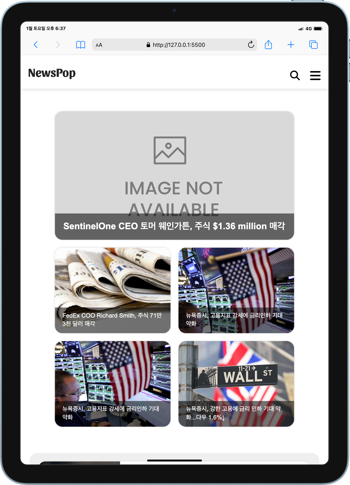
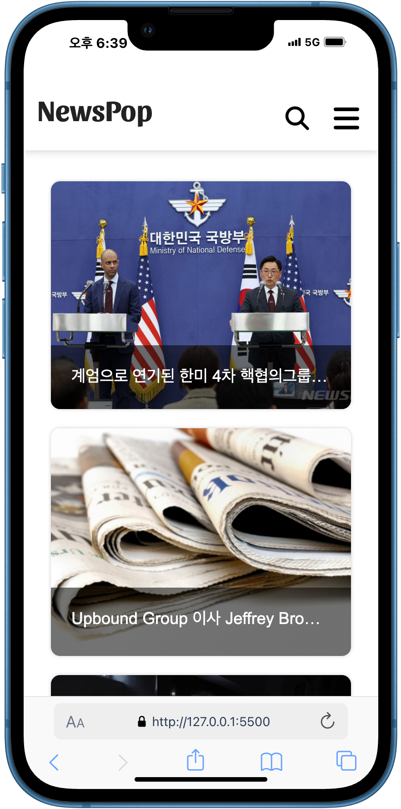

# NewsPop 뉴스 웹사이트

오픈 api이용한 반응형 뉴스 웹사이트 제작 <br><br>
Demo : https://kminjoo9093.github.io/NewsPop-project
<br><br>




<br><br>

### **개발 목표**

- 오픈 api를 이용해 조건에 맞는 다양한 데이터를 요청하고 처리하는 방법 학습<br>
- 그 과정에서 발생하는 에러 상황을 처리하고 사용자에게 적절한 메시지 제공
  <br><br>

### **사용 기술**

- HTML
- CSS
- Javascript
- jQuery
  <br><br>

### **Advanced Features**

- **현재 카테고리 표시**<br><br>
  (PC 버전)<br>
  <br>
  (태블릿, 모바일 버전)<br>
  <br><br>
  [관련 코드]<br>
  선택한 카테고리 정보를 sessionStorage에 저장한다. 페이지 이동 후 저장된 카테고리 정보와 일치하는 카테고리의 스타일을 변경한다.<br>
  ```javascript
  //카테고리 별 뉴스 받아오기
  async function getNewsByCategory(e) {
  e.preventDefault();
  sessionStorage.clear();
  const selectedMenu = e.target.getAttribute("data-menu_en").toLowerCase();
  const url = new URL(baseUrl);
  url.searchParams.set("category", selectedMenu);
  newsList = await getNews(url);

  sessionStorage.setItem("category", selectedMenu);
  sessionStorage.setItem("newsList", JSON.stringify(newsList));
  window.location.href = e.target.href;
  }
  
  //문서 로드 후 스크린 크기 별 카테고리 처리
  document.addEventListener("DOMContentLoaded", () => {
    const storedCategory = sessionStorage.getItem("category");
    const storedKeyword = sessionStorage.getItem("keyword");
    const storedNewsList = sessionStorage.getItem("newsList");
    // 현재 카테고리 색상 표시
    if (storedCategory) {
      if (window.innerWidth > 1080) {
        document.querySelectorAll(".pc_menu a").forEach((a) => {
          a.getAttribute("data-menu_en").toLowerCase() === storedCategory
            ? a.style.color = "crimson"
            : a.style.color = "#222";
        });
      } else {
        const currentCategory = document.querySelector(".current-category");
        currentCategory.style.display = "block";
        currentCategory.textContent = storedCategory.toUpperCase();
      }
    }
  });
  ```
  <br><br>
- **더보기 클릭시 뉴스 불러오기**<br><br>
  <br><br>
  [관련 코드]<br>
  ```javascript
  // ===== subpage 더보기 클릭 시 뉴스 추가로 보여주기 =====
  // 처음 로드 시 4개만 보이도록
  const news = document.querySelectorAll("#category .news"),
        newsNumToShow = 4;
  news.forEach((el) => {
    el.style.display = "none";
  });
  let newsListOfSubpage = Array.from(news);
  getRestNews();
  
  function getRestNews() {
    newsListOfSubpage.splice(0, newsNumToShow).forEach((news) => {
      news.style.display = "block";
    });
  }
  // 더보기 클릭 시 4개씩 추가
  function viewMoreNews() {
    if (newsListOfSubpage) {
      getRestNews();
      if (newsListOfSubpage.length === 0) {
        document.querySelector(".view-more-news .more-btn").style.display =
          "none";
      }
    }
  }
  ```
<br><br>
### **개선 사항**
- 태블릿/모바일 버전에서 카테고리를 처음 눌렀을 때에는 해당 카테고리가 바로 나타나지 않는 점 개선 필요
<br><br>
### **프로젝트 진행하며 배운 내용**
- @support : 브라우저에서 지원을 하는 경우 스타일을 조건적으로 활용함으로 브라우저 호환성 관리와 최신 css를 활용하는 방법
- 메인페이지에서 서브페이지로 이동할 때 sessionStorage 활용하여 카테고리, 검색 키워드 기억하기

