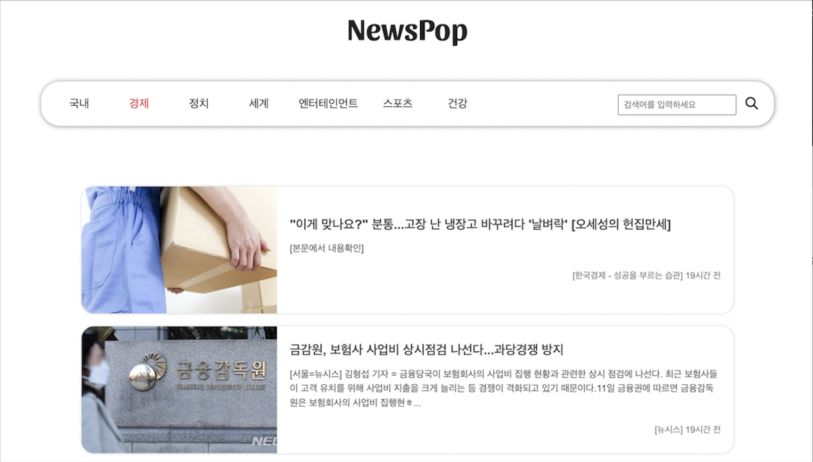

# NewsPop 뉴스 웹사이트

오픈 api이용한 뉴스 웹사이트 제작   
Demo : https://kminjoo9093.github.io/NewsPop-project/index.html
 

  

### **개발 목표**

- 오픈 api를 이용해 조건에 맞는 다양한 데이터를 요청하고 처리하는 방법 학습 
- 그 과정에서 발생하는 에러 상황을 처리하고 사용자에게 적절한 메시지 제공
    

### **사용 기술**

- HTML
- CSS
- Javascript
- jQuery
    

### **Advanced Feature**

- 현재 카테고리 표시 
  (PC 버전) 
   
  (태블릿, 모바일 버전) 
  
    

### **개선 사항**
